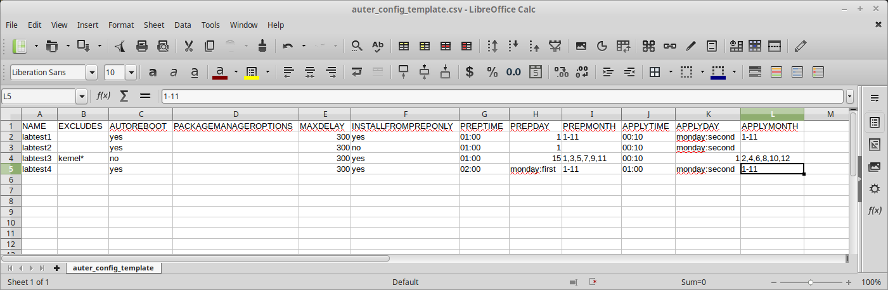

# auter-manager

## Cloning this branch of the repository
This branch is a refreshed write of the current master branch, converting the Ansible playbook into the '/roles' recommended tree structure.

The easiest way to set up branch 'modular' is to directly clone the branch into a new dedicated directory.
For example:
```
git clone -b modular git@github.com:rackerlabs/auter-manager.git auter-manager_modular
```

## Presentation
This repo contains ansible playbooks to install and configure [Auter](https://github.com/rackerlabs/auter) on RHEL-derivative devices through automation using a single csv file to handle configuration settings.


The playbooks require a csv file to run (`auter_config.csv` by default). A template file `auter_config_template.csv` is provided as a sample, matching the following array in csv format:

| NAME | EXCLUDES | AUTOREBOOT | PACKAGEMANAGEROPTIONS | MAXDELAY | INSTALLFROMPREPONLY | PREPTIME | PREPDAY | PREPMONTH | APPLYTIME | APPLYDAY | APPLYMONTH | ALWAYSREBOOT |
| --- | --- | --- | --- | --- | --- | --- | --- | --- | --- | --- | --- | --- |
| labtest1 |  | yes |  | 300 | yes | 01:00 | 1 | 1-11 | 00:10 | monday:second | 1-11 | |
| labtest2 |  | yes |  | 300 | no | 01:00 | 1 |  | 00:10 | monday:second |  | |
| labtest3 | kernel\* | no |  | 300 | yes | 01:00 | 15 | "1,3,5,7,9,11" | 00:10 | 1 | "2,4,6,8,10,12" | yes |
| labtest4 | "" | yes |  | 300 | yes | 02:00 | monday:first | "1-11" | 01:00 | monday:second | 1-11 | yes |

**Important**
- Whenever setting a list of values, be mindful of wrapping the values with double quotes (`" "`) if using comma (`,`) inside a field (cf _labtest3_ in sample table).
- Setting a value of `""` or `''` for _EXCLUDES_ field (ex: _labtest4_ above) will **remove** any existing excludes.

Things to consider when filling the csv file:
1. `auter-prep` and `auter-apply` can be set up to run at most once a month when using this playbook.
1. fields from **PREPTIME** onwards are only mandatory if you use playbook `auter_scheduler.yml` or the meta-playbook `auter_manager.yml` as they only concern the cron settings.
1. you cannot use cron notation `*/n` to define periodicity, but '`,`' and '`-`' are supported for month setting.
1. **PREPDAY** and **APPLYDAY** can be entered either as a single number (1 to 28) or as a pair separated by colon `:`
`<lettered_day_of_the_week:nth_occurence>` (*nth_occurence* among `first`, `second`, `third` or `fourth`)
  * Valid examples:
    * `monday:second`
    * `10`

### Detailed description for each field

| Field | Description | Default value |
| --- | --- | --- |
| NAME | Ansible inventory hostname  | N/A |
| EXCLUDES | List of packages to exclude | None |
| AUTOREBOOT | Should the device be rebooted if packages have been updated? | `yes` |
| PACKAGEMANAGEMENTOPTIONS | Options to pass to package manager. If dnf is installed, it will be the preferred package manager. | None |
| MAXDELAY |  Upper limit of a random time to wait before querying repositories. This applies to downloading updates (--prep) and installing updates (--apply). This is used to stagger load on the repository servers. | `3600` |
| INSTALLFROMPREPONLY | Only install from the packages downloaded during `auter-prep`. | `no` |
| PREPTIME | Time to execute `auter-prep` | None |
| PREPDAY | Day to execute `auter-prep` | None |
| PREPMONTH | Month(s) to execute `auter-prep` | None |
| APPLYTIME | Time to execute `auter-apply` | None |
| APPLYDAY | Day to execute `auter-apply` | None |
| APPLYMONTH | Month(s) to execute `auter-apply` | None |
| ALWAYSREBOOT | Should the device systematically be rebooted after patching? ==This option superseeds **AUTOREBOOT**.==  | `no` |


## Playbooks
- `auter_manager.yml` loads up `auter_installer` and `auter_scheduler` roles to install, configure and schedule Auter based on devices configured in the CSV file. It is intended to be the 'default' playbook to use to set up everything in one go.
- `auter_install.yml` will install and configure Auter based on devices configured in the CSV file.
- `auter_scheduler.yml` on its own handles the crontab configuration for the two main fonctions of Auter: prep and apply. The play will write the cron scheduling into file **/etc/cron.d/auter**
- `auter_reporter.yml` is an easy way to gather information on Auter status and latest use for any number of devices. The result file will be place into sub-directory **output**.

## Why csv format?
Using the csv file should make it easy to keep configuration reference easily readable from a spreadsheet editor, so that it can be maintained by non-tech people.  
**note:** you should not add/remove any columns or the playbook execution will break. The csv file should suffice as the only source for Auter installation / configuration / scheduling.
